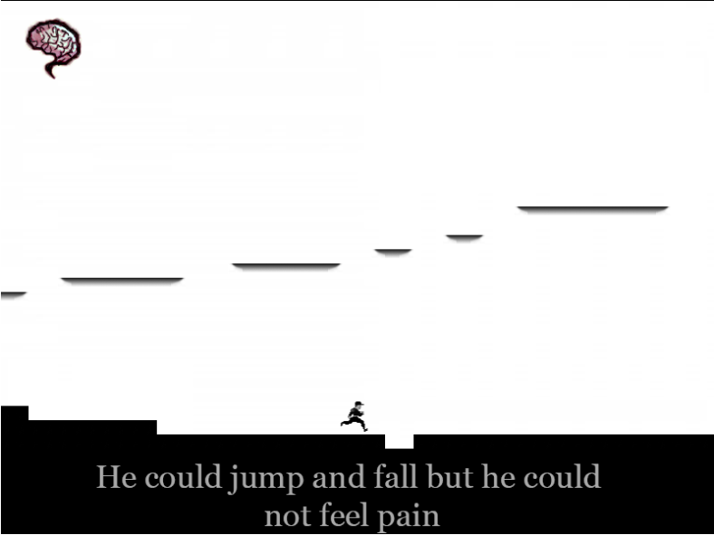
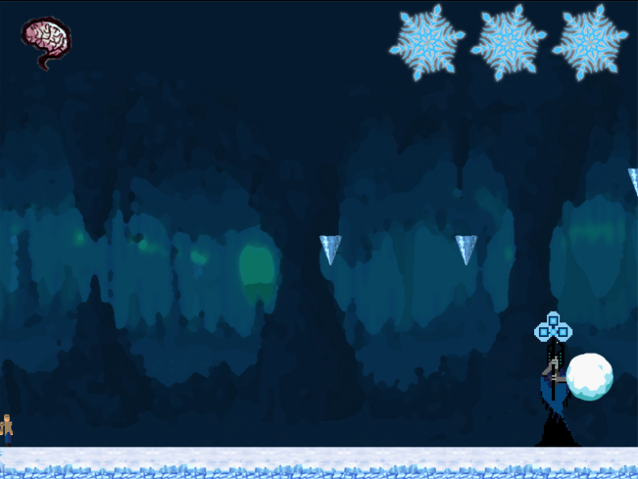

# (Sub)Conscious

Welcome to (Sub)Conscious, a classic 2D platformer game built using Phaser! Jump into a world of our troubled hero, where you'll traverse through challenging levels and face off against epic boss battles.

[!NOTE] This project was made in 2018 for the purposes of FIKT CodeCup.

## Features

- **Classic Gameplay**: Experience the nostalgia of classic 2D platformer mechanics with modern twists.
- **Pixel Art Style**: Immerse yourself in charming pixel art graphics that bring the game world to life.
- **Multiple Levels**: Enjoy a variety of levels, including 3 regular levels filled with obstacles and enemies, and 3 intense boss levels that will test your skills.
- **Responsive Controls**: Tight and responsive controls ensure smooth gameplay as you navigate through each level.
- **Engaging Boss Fights**: Prepare for epic showdowns as you encounter formidable bosses at the end of each stage.
- **Unlockables**: Discover hidden secrets and unlock special rewards as you progress through the game.

## Installation

1. Clone the repository or download the ZIP file.
2. Ensure you have Node.js and npm installed on your system.
3. Navigate to the project directory in your terminal.
4. Run `npm install` to install the necessary dependencies.
5. Start the game by running `npm start`.
6. Open your web browser and navigate to `http://localhost:8080` to play the game.

## Controls

- **Arrow keys**: Move left/right and duck.
- **Spacebar**: Jumping.
- **Q**: Shoot
- **1,2,3**: Change weapon types

## Screenshots

*Caption: Traverse through challenging levels filled with obstacles and enemies.*

*Caption: Face off against epic bosses in intense battles to progress through the game.*

## Trailer

Watch the official trailer on [YouTube](https://www.youtube.com/watch?v=dKmEz1gcFqc&t=1s).

## Play the Game

Play the game [here](https://sub-conscious.web.app/).

## Credits

- **Game Development**: Stefan Bojadziev and David Talevski
- **Artwork**: Stefan Bojadziev and David Talevski

## License

This project is licensed under the [MIT License](LICENSE).
